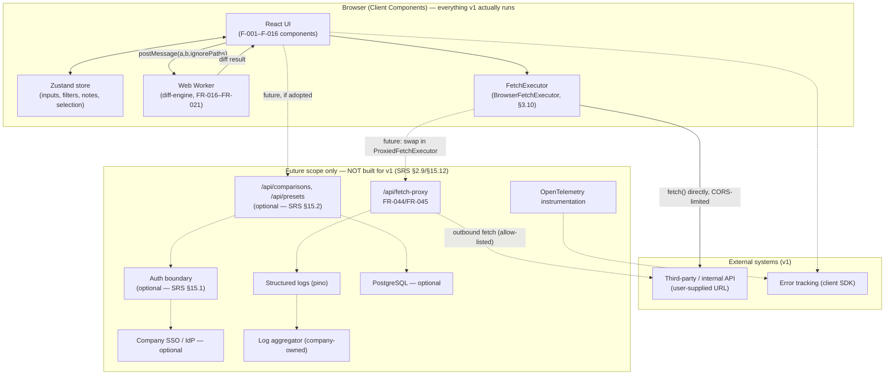
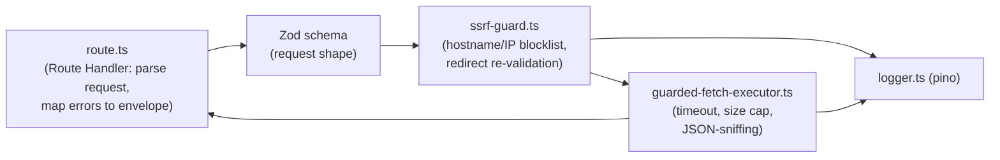
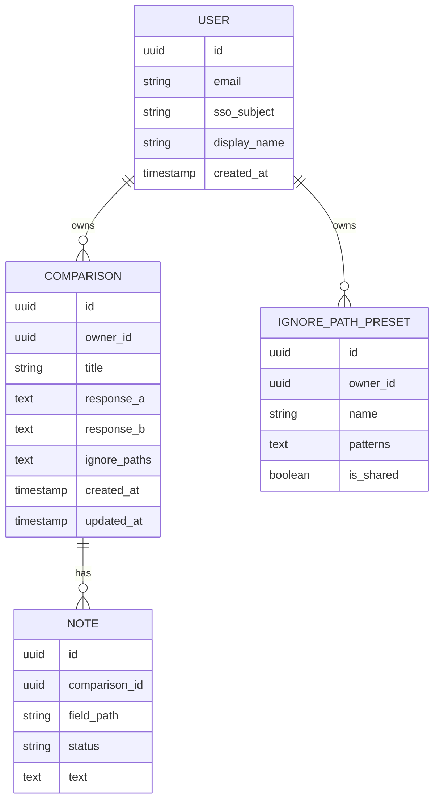
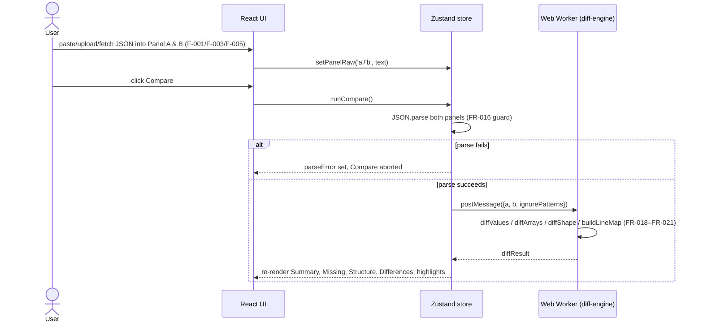
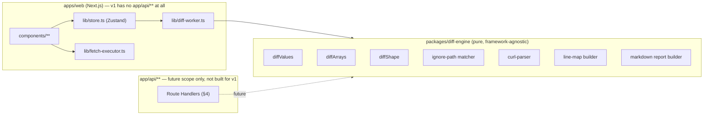
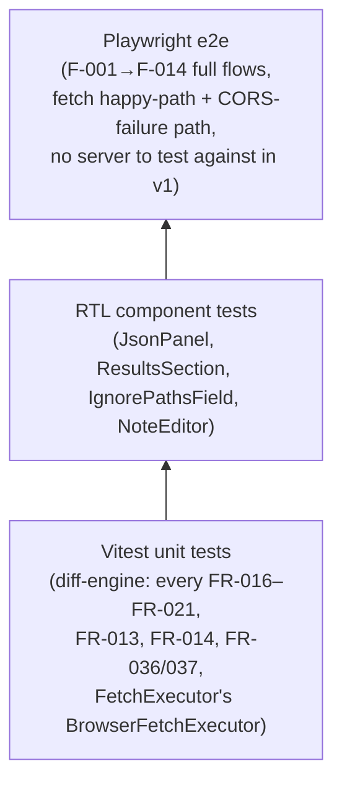
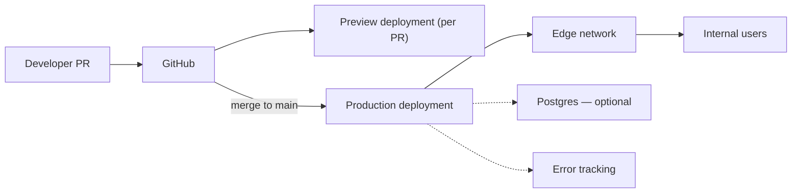
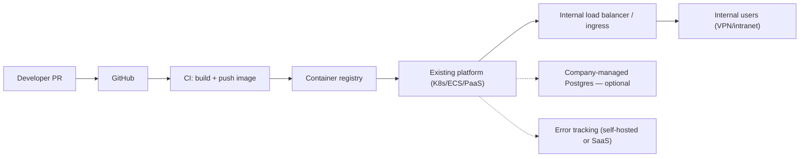
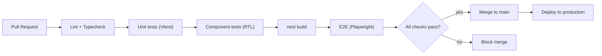

# ARCHITECTURE.md — System Architecture

**Project:** JSON Response Comparer — standalone, production-ready conversion
**Companion docs:** `SRS.md` (requirements, FR-xxx/NFR-xxx, canonical Open Questions in §15), `FEATURES.md` (F-xxx feature inventory this architecture implements), `TECH_STACK.md` (technology rationale), `IMPLEMENTATION_PLAN.md` (phasing, Agent Implementation Guidance)
**Status:** Specification — implementation has not started

> This document is written to be sufficient on its own for a senior engineer — or another AI coding agent — to understand exactly how the system is structured, why each technology decision was made, where every package belongs, how data flows, where module boundaries sit, and how to implement it, without needing to go back and re-derive anything from the original artifact. Every open, undecided item is cited by its `SRS.md` §15 number rather than silently resolved.

---

## 1. Architecture goals & principles

1. **Preserve the artifact's value; remove what makes it unshippable.** No types, no tests, DOM-coupled business logic, zero observability. **v1 deliberately keeps the artifact's client-only fetch model** (see principle 4) rather than replacing it — that decision is explicit, not an oversight.
2. **Isolate the pure logic.** The diff engine, ignore-path matcher, curl parser, and Markdown report builder must not know React, the DOM, or Next.js exist — see `packages/diff-engine` in §9.
3. **Server Components by default, Client Components by exception.** Static shell renders on the server; anything stateful (editors, diff results, filters) is an explicit, small, well-bounded client island. **v1 needs no server-rendered data and no backend route at all** — this principle is about the rendering boundary, not a claim that a backend exists.
4. **No backend required for v1; keep the seam open, don't build the door.** The artifact's fetch feature (F-005) runs directly from the browser in v1, exactly as it does today — a deliberate scope decision (`SRS.md` §1.3), not a gap. What *is* built is a small interface boundary (`FetchExecutor`, §3.10) so that a hardened server-side proxy (FR-044, `SRS.md` §2.9) can be added later, if `SRS.md` §15.12's trigger condition is ever met, without touching any calling code. Building that proxy now, with no driving need, would be exactly the kind of speculative infrastructure principle 5 rejects.
5. **Don't build for scale — or infrastructure — that doesn't exist.** No microservices, no queues, no GraphQL, and (for v1) no backend at all — see `TECH_STACK.md` §5 for what was deliberately rejected and why, and §4 below for the backend layer specifically deferred rather than rejected outright.
6. **Every architectural decision traces to a requirement.** Component/route/package names below map onto `FEATURES.md`'s Feature Coverage Matrix (§17 there) — nothing here is invented independent of a cited F-xxx/FR-xxx.

---

## 2. System architecture

### 2.1 Application boundaries

- **Client:** the Next.js React app running in the user's browser — owns all UI, in-memory diff/session state, the Web Worker running the diff engine, and — for v1 — the fetch feature itself (a direct browser `fetch()`, §3.10).
- **Server:** **not required for v1.** The v1 baseline has zero server-side responsibility — no Route Handlers, no Server Actions, no API surface. Next.js Route Handlers/Server Actions are a *reserved, designed-but-unbuilt* extension point (§4) for a future fetch-proxy and/or persistence API, adopted only if `SRS.md` §15.12/§15.2 trigger it.
- **Database:** does not exist in the baseline scope. Only instantiated if `SRS.md` §15.2 is answered "yes" (§5.2 below).
- **External services:** whatever third-party/internal API the user points the fetch feature at (arbitrary, user-supplied, per-request — not a fixed integration, reached directly from the browser in v1); optionally, in the future, an identity provider (§15.1) and an error-tracking/observability backend (the latter's client-side half — Sentry's browser SDK — is used in v1 regardless, per §7).
- **Deployment:** Option A (managed platform) or Option B (company infrastructure) — both documented in full in §13. For v1, both options are deploying a **static-capable, backend-free Next.js app**; the choice matters for future backend hosting, not for anything v1 needs today.

### 2.2 High-level diagram



**Reading this diagram:** in v1, everything runs in the browser — diffing, filtering, tree rendering, export, and the fetch feature itself (F-005) all execute client-side, with zero server involvement, exactly matching the artifact's own model. The `Future` subgraph is not built: it is the fully-designed extension point (§4) that a later engineer plugs in by swapping `FetchExecutor`'s implementation and, separately, adding the persistence API — neither requires re-architecting anything in the `Client` subgraph.

---

## 3. Frontend architecture

### 3.1 Routing

Single route: `/` (`app/page.tsx`). No other pages exist in the baseline scope — the artifact is single-page, and nothing in `FEATURES.md` implies additional routes. If the persistence module is adopted, it adds: `/comparisons/[id]` (view a saved comparison, FR-046) and, optionally, `/comparisons` (history list, FR-048) — both are net-new routes with no artifact precedent, specified in `SRS.md` §6 and left un-built until `SRS.md` §15.2 is answered.

### 3.2 Layouts

One root layout (`app/layout.tsx`) — header + main content area. No nested layouts are needed for a single-route app; do not add one speculatively.

### 3.3 Feature modules → components

| `FEATURES.md` feature | Component(s) | Client/Server |
|---|---|---|
| F-001 Dual JSON Input Panels | `components/panels/JsonPanel.tsx`, `JsonEditor.tsx` | Client (stateful editing) |
| F-002 JSON Tree View | `components/panels/JsonTreeView.tsx` | Client (re-parses on every keystroke while active) |
| F-003 Add Data Modal | `components/modals/AddDataModal.tsx` | Client (Radix `Dialog`) |
| F-004 Curl Command Parsing | `lib/curl-parser.ts` | Pure function, no component — imported by client code |
| F-005 Fetch Execution | `lib/fetch-executor.ts` (client, `BrowserFetchExecutor`) + `AddDataModal.tsx`/`InlineCurlBar.tsx` (callers) | 100% Client for v1 — no server route exists; a future `ProxiedFetchExecutor` (§3.10, §4) is designed but not built |
| F-006 Ignore Paths | `components/ignore-paths/IgnorePathsField.tsx` | Client |
| F-007 Compare Engine | `packages/diff-engine` (pure) + `lib/diff-worker.ts` (worker wrapper) + `components/CompareToolbar.tsx` (trigger) | Worker + Client trigger |
| F-008 Highlighting System | Rendering logic inside `JsonEditor.tsx`/`JsonTreeView.tsx`, driven by store selectors | Client |
| F-009 Results Summary | `components/results/SummaryChips.tsx` | Client |
| F-010 Missing Fields Section | `components/results/MissingFieldsSection.tsx`, `NoteEditor.tsx` | Client |
| F-011 Structure Schema Compare Section | `components/results/StructureCompareSection.tsx` | Client |
| F-012 Differences Section | `components/results/DifferencesSection.tsx` | Client |
| F-013 Collapsible Result Sections | Composition within `ResultsWrap` (shared `<details>`/Radix `Collapsible`) | Client |
| F-014 Markdown Export | `packages/diff-engine/src/markdown-report.ts` (pure) + `components/export/ExportPreviewPanel.tsx` | Pure + Client |
| F-015 Sample Data / Reset | `components/CompareToolbar.tsx` + store actions | Client |
| F-016 Miscellaneous UI | `components/ScrollTopButton.tsx`, `app/globals.css`, shared status slice in the store | Client |

The static outer shell (`app/page.tsx`'s own JSX before it renders the client islands, plus `app/layout.tsx`) is the only Server Component content — everything in the table above is a client boundary because every one of F-001 through F-016 is inherently interactive.

### 3.4 Shared components

Generated once via the shadcn/ui CLI into `components/ui/` (`Dialog`, `Tabs`, `Select`, `Checkbox`, `Tooltip`, `Collapsible`) — see `TECH_STACK.md` §2.4 and the Package Responsibility Map (§8 below) for what belongs here vs. in feature components. **Rule:** `components/ui/*` contains zero domain knowledge (no diff-category colors, no "Missing Fields" strings) — feature components compose these primitives and supply all domain-specific content/styling.

### 3.5 Hooks

| Hook | Purpose | Used by |
|---|---|---|
| `useLineGutter` | Encapsulates the soft-wrap-aware line-number measurement algorithm (F-001.8) | `JsonEditor.tsx` |
| `useFindInText` | Encapsulates in-panel find/match-navigation state (F-001.5) | `FindBar.tsx` |
| `useScrollIndicators` | Computes "N more above/below" pill state from the current highlight map + scroll position (F-001.11/F-002.6) | `JsonEditor.tsx`, `JsonTreeView.tsx` |
| `useDiffWorker` | Wraps the Web Worker lifecycle (spawn once, post messages, receive typed results) | `CompareToolbar.tsx` (or wherever `runCompare` is invoked from) |

Each hook owns **presentation-adjacent** logic only (DOM measurement, scroll math, worker lifecycle) — the actual diff/ignore-path/report algorithms live in `packages/diff-engine` and are called *by* these hooks/components, never reimplemented inside them.

### 3.6 State management

One Zustand store (`lib/store.ts`), organized by domain slice — see the full shape in §8's Package Responsibility Map entry for `zustand`, and the complete TypeScript interface below (unchanged from the prior architecture draft, now cross-referenced to F-IDs):

```ts
interface CompareStore {
  // F-001
  panelA: { raw: string; parsed: unknown | null; parseError: string | null; curlText: string };
  panelB: { raw: string; parsed: unknown | null; parseError: string | null; curlText: string };
  // F-006
  ignorePathsRaw: string;

  // F-007 — set once by the worker's result, never mutated piecemeal
  diffResult: {
    missing: MissingField[];
    changed: ChangedField[];
    structure: StructureFinding[];
    lineMapA: Map<string, number>;
    lineMapB: Map<string, number>;
  } | null;

  // F-001.6
  activeTab: { a: 'json' | 'tree'; b: 'json' | 'tree' };
  // F-008
  highlightToggles: { missing: boolean; structure: boolean; differences: boolean };
  // F-010
  missingFilters: { onlyA: boolean; onlyB: boolean; showIgnored: boolean; text: string; level1: Map<string, boolean>; level2: Map<string, boolean> };
  // F-011
  structureFilters: { missingInB: boolean; extraInB: boolean; inconsistentInA: boolean; showIgnored: boolean; text: string };
  // F-012
  differencesFilters: { showIgnored: boolean; text: string };
  // F-010.5 / F-010.6
  selectedMissingPaths: Set<string>;
  notes: Map<string, { status: NoteStatus; text: string }>;

  // Actions — one per mutation the UI needs; each mirrors an SRS.md FR 1:1
  setPanelRaw(target: 'a' | 'b', raw: string): void;
  runCompare(): Promise<void>;         // FR-016–FR-021, resets selection (F-007 edge case), NOT notes
  setIgnorePathsRaw(v: string): void;  // FR-014
  toggleHighlight(category: HighlightCategory): void; // FR-022
  setNote(path: string, patch: Partial<{ status: NoteStatus; text: string }>): void; // FR-030
  clearAll(): void;    // FR-040 — must NOT touch ignorePathsRaw (F-015 edge case)
  loadSample(): void;  // FR-039 — DOES overwrite ignorePathsRaw
}
```

**This state shape is a direct, deliberate encoding of the artifact's own state-persistence asymmetries** (documented in `FEATURES.md` F-006/F-007/F-010/F-015): `runCompare()` resets `selectedMissingPaths` but never touches `notes`; `clearAll()` resets everything *except* `ignorePathsRaw`; `loadSample()` is the only action that overwrites `ignorePathsRaw`. A future engineer "cleaning this up" to make all state reset uniformly would be introducing a real behavior regression, not a simplification — this is called out explicitly so it survives code review.

### 3.7 Server state

Only relevant if the persistence module is adopted (`SRS.md` §15.2) — TanStack Query owns `Comparison`/`IgnorePathPreset` fetch/cache/invalidate; v1 has no server state at all, since it has no server (the fetch feature is a one-shot client-side action, not cached data, whether or not a future proxy sits behind it).

### 3.8 Forms

No traditional form exists in the baseline scope — every input (JSON panels, Ignore Paths, notes, filters) is an uncontrolled-feeling-but-store-backed field with immediate, per-keystroke state updates, not a submit-validated form. React Hook Form is listed in `TECH_STACK.md` as a **should-have**, scoped specifically to the optional persistence module's "save comparison" naming dialog and preset-naming form — it has no role in the baseline feature set and must not be reached for reflexively where a simple controlled input suffices.

### 3.9 Validation

- **Client-side:** `JSON.parse` at Prettify/Compare time (FR-004/FR-016) — this *is* the artifact's validation model; do not add a stricter client-side JSON Schema validator that the artifact never had.
- **Fetch request shape (v1):** no validation beyond F-004's parser output — matches the artifact, which never validated the parsed `{url, method, headers, body}` shape before calling `fetch()` either.
- **Server-side (fetch-proxy) — future scope only, not built for v1:** if adopted, Zod would validate the `{url, method, headers, body}` request shape before any SSRF/network logic runs (FR-044).
- **Server-side (persistence, if adopted) — future scope only:** Zod would validate all persisted payloads.

### 3.10 API/service layer — the `FetchExecutor` boundary (this is the mechanism that keeps the backend layer optional)

This is the single most important seam introduced for the "no backend for v1, but keep it open" decision (`SRS.md` §1.3/§15.12). Rather than any component calling the browser's global `fetch()` directly, every caller depends on a small interface:

```ts
// lib/fetch-executor.ts
interface FetchRequest { url: string; method: string; headers: Record<string, string>; body: string | null }
interface FetchResult { status: number; statusText: string; bodyText: string; isJson: boolean }

interface FetchExecutor {
  execute(request: FetchRequest): Promise<FetchResult>; // throws on network/CORS failure, matching the artifact's own error path
}

// v1's only implementation — a direct, un-guarded browser fetch, matching the artifact exactly:
class BrowserFetchExecutor implements FetchExecutor {
  async execute(request: FetchRequest): Promise<FetchResult> {
    const res = await fetch(request.url, { method: request.method, headers: request.headers, body: request.body ?? undefined });
    const bodyText = await res.text();
    const isJson = isJsonParseable(bodyText); // same JSON-sniffing rule as F-005's business logic
    return { status: res.status, statusText: res.statusText, bodyText, isJson };
  }
}

// The one call site every component uses — never `fetch()` directly:
export const fetchExecutor: FetchExecutor = new BrowserFetchExecutor();
```

`AddDataModal.tsx` and `InlineCurlBar.tsx` call `fetchExecutor.execute(...)` — never the global `fetch()` — and handle exactly the same success/error states F-005 already specifies. **This is the entire mechanism that keeps the backend layer "open for future scope":** if `SRS.md` §15.12's trigger condition is ever met, a `ProxiedFetchExecutor` implementing the same `FetchExecutor` interface (calling `POST /api/fetch-proxy` instead of `fetch()` directly) is written, and the exported `fetchExecutor` singleton is swapped to point at it — `AddDataModal.tsx`, `InlineCurlBar.tsx`, and every test written against the `FetchExecutor` interface (rather than against `BrowserFetchExecutor` concretely) need **zero changes**. This is why `FEATURES.md` F-005 and `SRS.md` FR-003 both describe the v1 behavior as "final," not "temporary" — the seam, not a half-built proxy, is what makes the future path cheap.

Beyond this, `lib/curl-parser.ts` (F-004, pure — actually implemented in `packages/diff-engine`, re-exported for app-local use per the Phase 2 decision point in `IMPLEMENTATION_PLAN.md`) is the rest of the client-side "service layer" in v1. There is deliberately no generic API-client abstraction layer (no tRPC, no generated OpenAPI client, no `lib/api-client.ts`) because v1 calls no API at all. Revisit only if the persistence module's endpoints (§6 in `SRS.md`) are adopted and a hand-written-fetch approach for those starts feeling repetitive — that is a separate concern from the `FetchExecutor` boundary above, which stays exactly as-is regardless.

### 3.11 Error handling (frontend)

- One `ErrorBoundary` around each `JsonPanel` and one around `ResultsWrap` (NFR-004) — a rendering bug in the Tree view, say, does not blank the whole page.
- Every guard/validation failure writes to the single shared status slice (F-016.3/FR-043) — components read this via a selector, they do not manage their own local "error" state for these cases.

---

## 4. Backend/API architecture — Future Scope (not built for v1)

**Status: none of §4.1–§4.4 below is implemented, or part of v1's Definition of Done (`SRS.md` §14). v1 ships with zero backend, per `SRS.md` §1.3.** This section is written in full so that, if `SRS.md` §15.12's trigger condition is ever met, the backend layer gets built from a real design rather than improvised under time pressure — and so that `packages/diff-engine`, the `FetchExecutor` boundary (§3.10), and the folder structure (§10) are shaped correctly from day one to receive it with no rework. Read everything below as "the plan for later," not "what to build now."

### 4.1 API boundaries (future)

Exactly one endpoint, if built. This is a deliberate, minimal boundary — see `TECH_STACK.md` §2.9 for why a full REST/GraphQL layer or tRPC was not adopted for something this narrow.

### 4.2 Routes/endpoints (future)

`POST /api/fetch-proxy` — would be implemented as a Next.js Route Handler (`app/api/fetch-proxy/route.ts`), Node.js runtime (not Edge — full control over DNS/IP-literal checks is required for FR-044 and is harder to guarantee under the Edge runtime's fetch abstraction). This would be the concrete home for a `ProxiedFetchExecutor` (§3.10) to call.

### 4.3 Controllers/handlers → Services → Domain logic → Data access (future)

For this one endpoint, the layering would be intentionally thin (do not over-engineer a five-layer architecture for a single route):



- `route.ts` — the Route Handler itself: receives the request, calls Zod validation, calls the guard, calls the executor, maps any thrown/returned error to the typed envelope (FR-045), never contains the SSRF logic or the fetch logic directly.
- `ssrf-guard.ts` — pure-ish function(s): given a URL, resolve and check its host/IP against the blocklist (and re-check on any redirect target) — this is where FR-044 would live, and it would be the single most security-critical file in the entire codebase; it should be small, obviously correct, and heavily unit-tested in isolation from the Route Handler.
- `guarded-fetch-executor.ts` — **named deliberately differently from the client-side `lib/fetch-executor.ts` (§3.10) to avoid confusion between the two** — performs the actual guarded `fetch()` call with `AbortController`-based timeout and a streamed read capped at the size limit; detects JSON via `JSON.parse` attempt (matching the artifact's own JSON-sniffing behavior, F-005) rather than trusting `Content-Type`. This is the implementation *behind* the future `ProxiedFetchExecutor`, not a replacement for it.
- `logger.ts` — the one place request/response metadata is written; deliberately never given the request/response *bodies* or header *values* (only header *names*, if ever logged at all) per FR-045/NFR-008.

If the persistence module is adopted, its four/five endpoints would follow the same shape (Route Handler → Zod validation → a small service function → Drizzle query), with Server Actions used instead of Route Handlers for the simplest create/update mutations (`saveComparison`, `savePreset`) — see `TECH_STACK.md` §2.9.

### 4.4 Authentication / authorization (future)

None in v1 (`SRS.md` §15.1 pending, and moot without a backend anyway). If a backend and auth are both adopted: a single `middleware.ts` would gate `/api/comparisons/**`, `/api/presets/**`, and any UI route showing saved data. **The fetch-proxy itself would not be gated by this middleware even if auth is added elsewhere**, unless a future decision explicitly extends the auth boundary to cover it too — this is deliberately called out so it isn't silently assumed either way during implementation.

---

## 5. Data architecture

### 5.1 Baseline scope

No persisted entities exist, and no server-side data ownership exists at all in v1 — there is no backend (§4) to own anything. All "data" is the in-memory Zustand store shape in §3.6, owned entirely by the client. F-005's fetch feature is a stateless, client-side request/response; nothing about it is stored anywhere, in v1 or in the future-scope proxy design.

### 5.2 Optional persistence module — entities & relationships (future scope only, not built for v1)

Only built if `SRS.md` §15.2 is answered "yes" — which itself presupposes the backend layer in §4 exists. PostgreSQL via Drizzle ORM (`TECH_STACK.md` §2.11).



### 5.3 Data ownership & client/server boundary (future scope only)

- The client **never** talks to the database directly — no exposed connection string, no client-side DB SDK. All reads/writes go through Route Handlers/Server Actions. (Moot for v1, which has neither a database nor a server.)
- `response_a`/`response_b` are stored as `text`, not `jsonb`, **deliberately** — the tool must round-trip the user's exact original formatting/ordering for re-display (FR-046's acceptance criterion is byte-for-byte, not semantically-equivalent), which a `jsonb` column would not preserve (Postgres normalizes/re-serializes JSONB).
- If `SRS.md` §15.4 requires it, `response_a`/`response_b`/`Note.text` are additionally encrypted at the application layer (on top of the provider's disk-level encryption) — not built speculatively; built exactly to whatever §15.4 decides, once decided.

---

## 6. Application data flow

The canonical `UI → State → Service → API → Database → Response → State → UI` chain, instantiated for this app's real v1 flow and its future-scope variant (there is no API or database in v1's flow at all, per §5.1 — the "Service" step is the `FetchExecutor` boundary, §3.10):

### 6.1 Compare flow (FR-016–FR-021)



### 6.2 Fetch-via-curl flow — v1 (F-005, FR-003)

```mermaid
sequenceDiagram
    actor User
    participant UI as React UI (AddDataModal)
    participant Exec as FetchExecutor (BrowserFetchExecutor, §3.10)
    participant Target as Target API

    User->>UI: paste curl command, click "Go"
    UI->>UI: parseCurlCommand() (F-004, pure, no network)
    UI->>Exec: execute({url, method, headers, body})
    Exec->>Target: fetch(url, {method, headers, body}) — direct from the browser, CORS applies
    Target-->>Exec: response (or a thrown network/CORS error)
    Exec->>Exec: detect JSON via JSON.parse attempt (matches artifact's own sniffing)
    Exec-->>UI: {status, statusText, bodyText, isJson} (or a thrown error, shown as "usually a CORS restriction")
    UI->>UI: pretty-print into panel if isJson; show status; keep curl bar editable (F-001.7)
```

No server participates in this flow — it is identical in shape to the artifact's own `executeFetchInto`, just routed through the `FetchExecutor` interface instead of calling `fetch()` inline.

### 6.2a Fetch-via-curl flow — future scope only, NOT built for v1 (`SRS.md` §2.9/§15.12)

If the deferred backend layer is adopted, only the *implementation behind* `FetchExecutor` changes — the UI steps before and after are unchanged from §6.2:

```mermaid
sequenceDiagram
    actor User
    participant UI as React UI (AddDataModal)
    participant Exec as FetchExecutor (ProxiedFetchExecutor)
    participant API as /api/fetch-proxy
    participant Target as Target API

    User->>UI: paste curl command, click "Go"
    UI->>UI: parseCurlCommand() (F-004, pure, no network — unchanged from v1)
    UI->>Exec: execute({url, method, headers, body}) — same call signature as v1
    Exec->>API: POST {url, method, headers, body}
    API->>API: Zod validate + SSRF blocklist check (FR-044)
    alt host blocked
        API-->>Exec: 400 {error:'blocked_host'} (FR-045)
    else host allowed
        API->>Target: fetch(url, {method, headers, body, redirect:'manual', signal: timeout})
        Target-->>API: response (or timeout/network error)
        API->>API: cap body read at size limit; detect JSON; log {host, status, duration, corrId}
        API-->>Exec: {status, statusText, bodyText, isJson}
    end
    Exec-->>UI: {status, statusText, bodyText, isJson} — same shape v1 already returns
    UI->>UI: pretty-print into panel if isJson; show status; keep curl bar editable (F-001.7) — unchanged from v1
```

### 6.3 Save & retrieve flow (optional module only, future scope)

`UI → Store (dirty comparison state) → Server Action (saveComparison) → Zod validation → Drizzle insert → DB → success response → UI (shareable URL shown)`, and the mirror read path `UI (opens /comparisons/[id]) → Route Handler → Drizzle select → DB → response → Store (hydrated) → UI (panels populated)`.

---

## 7. Cross-cutting concerns

| Concern | Approach |
|---|---|
| Error handling | §3.11 (frontend — this is the only layer that exists in v1); §4.3 (backend, future scope only) — typed envelopes (future), error boundaries and a single shared status slice (v1) |
| Logging | v1: none server-side (no server exists). *(Future scope, §4)* `pino` structured JSON server-side; never payload bodies or credential header values (NFR-008/NFR-010) |
| Observability | v1: `@sentry/nextjs`'s client-side SDK only (browser exceptions). *(Future scope, §4)* Next.js `instrumentation.ts` (OpenTelemetry) wrapping Route Handlers; exported to an error-tracking/tracing backend (`TECH_STACK.md` §2.15) |
| Security | §12 below |
| Authentication/authorization | §4.4 — none in v1 (no backend to gate); future-scope-only, gated behind `SRS.md` §15.1 |
| Configuration | §15 below (env vars), validated via a Zod-backed env schema at startup |
| Caching | None required in the baseline scope — there is no server-derived data to cache; if persistence is adopted, TanStack Query's default caching is sufficient without a separate caching layer (no Redis, no CDN-level API caching — this is low-traffic internal tooling, not a scale problem) |
| Performance | NFR-001–NFR-003 — Web Worker offload for diffing, a payload-size guard, and no other special-casing needed at this traffic scale |
| Accessibility | `SRS.md` §7 — Radix-based primitives close the artifact's specific, enumerated gaps |
| Internationalization | Explicitly out of scope for v1 (NFR-011) — no i18n scaffolding built |
| Testing | §14 below |

---

## 8. Package Responsibility Map

This section exists so a future engineer (or another coding agent) never has to guess where a piece of logic belongs, or misuses a package outside its intended role. Format: **Package → Purpose → Used in → Works with → Should NOT contain.**

**`next`**
→ App framework: routing, SSR/streaming, bundling. **Route Handlers are a reserved-but-unused capability in v1** — no route exists until the future backend layer (§4) is built.
→ Used in: the entire `apps/web` shell.
→ Works with: React, Turbopack (built in).
→ Should NOT contain: diff/ignore-path/report business logic — that lives in `packages/diff-engine`, imported *by* Next.js code, never re-derived inside it.

**`react` / `react-dom`**
→ UI rendering runtime.
→ Used in: every component under `apps/web/components` and `apps/web/app`.
→ Works with: `zustand` (state), `@tanstack/react-query` (server state, optional module only).
→ Should NOT contain: the diff engine's pure functions — a component may *call* `runCompare()`, it must never reimplement a piece of `diffValues`/`diffShape` inline "just for this one screen."

**`zustand`**
→ Client UI/session state container (§3.6).
→ Used in: `apps/web/lib/store.ts`, read by nearly every component via selectors.
→ Works with: the Web Worker (receives `diffResult` back into the store), React components (subscribe via selectors).
→ Should NOT contain: business logic (diff computation, ignore-path matching, Markdown building) — the store holds data and thin action functions that call into `packages/diff-engine`; it is not where `diffValues` gets reimplemented.

**`@tanstack/react-query`** *(optional module only)*
→ Server-state fetch/cache/invalidate for `Comparison`/`IgnorePathPreset` data.
→ Used in: components under the optional `/comparisons` routes, only if `SRS.md` §15.2 is adopted.
→ Works with: the persistence API Route Handlers.
→ Should NOT contain: any of the baseline scope's diff/panel state — that is Zustand's job, not React Query's, even after persistence is added (they own genuinely different kinds of state).

**`zod`**
→ Runtime schema validation at every trust boundary that exists.
→ Used in v1: `lib/env.ts` (environment variables) — v1 has no other trust boundary needing it, since there is no server request to validate. *(Future scope, §4)* `app/api/fetch-proxy/route.ts` (request shape) and every persistence Route Handler/Server Action's input, if built.
→ Works with: `@t3-oss/env-nextjs` (env), `react-hook-form` resolvers (optional module forms).
→ Should NOT contain: the actual SSRF-blocklist logic or diff logic — Zod validates *shape*, `ssrf-guard.ts` (future scope) and `packages/diff-engine` own *behavior*.

**`react-hook-form`** *(optional module only)*
→ Form state/validation for the "save comparison" naming dialog and preset-naming form.
→ Used in: optional-module UI only.
→ Works with: Zod resolvers.
→ Should NOT contain: domain/business logic, and must not be reached for as a default for the baseline scope's panels/filters/notes, which are simple store-backed inputs, not a validated form.

**`packages/diff-engine`** *(internal workspace package, not a third-party dependency, but included here because it is the single most important "package" in the whole system)*
→ All diff/ignore-path/structure-compare/curl-parsing/Markdown-report/line-map logic (F-004, F-006, F-007, F-014).
→ Used in: the Web Worker (`lib/diff-worker.ts`), unit tests, and — if ever useful — directly from a Route Handler or future CLI, with zero duplication.
→ Works with: nothing beyond plain JS/TS built-ins — this is the entire point of the boundary.
→ Should NOT contain: React, the DOM, `fetch`, Next.js APIs, or Zustand — a single `import` of any of those into this package is an architecture violation, not a style nitpick, and should fail review.

**`lib/fetch-executor.ts`** *(app-local module, not a third-party dependency — included here because it is the specific mechanism that keeps the backend layer optional, per §3.10)*
→ The `FetchExecutor` interface plus its v1 `BrowserFetchExecutor` implementation.
→ Used in: `AddDataModal.tsx`, `InlineCurlBar.tsx` — every F-005 call site, exclusively through the exported `fetchExecutor` singleton, never via the global `fetch()` directly.
→ Works with: F-004's parsed curl/URL result as input.
→ Should NOT contain: SSRF guarding, timeout/size-cap logic, or any server-only concern — those belong to the future `ProxiedFetchExecutor` and its backing Route Handler (§4), never inlined into this file's v1 implementation.

**`drizzle-orm` / `drizzle-kit`** *(optional module only)*
→ Database schema, queries, migrations for the persistence entities (§5.2).
→ Used in: `packages/db`.
→ Works with: the Route Handlers/Server Actions that call it.
→ Should NOT contain: request parsing/validation (Zod's job) or business rules about, e.g., ignore-path matching (still `packages/diff-engine`'s job even when the patterns being matched came from a saved DB row).

**`better-auth`** *(optional module only, pending `SRS.md` §15.1)*
→ Session/auth boundary, OIDC/SSO plugin if federating into a company IdP.
→ Used in: `middleware.ts` and the persistence API's auth checks.
→ Should NOT contain: authorization *rules* specific to this app beyond "is this the comparison's owner" — anything more elaborate than owner-check-level authorization is a sign the requirement has grown beyond what §15.1/§15.2 originally scoped, and should trigger a spec update, not a quiet feature addition.

**`pino`** *(future scope only — not installed for v1, since there is no server to log from)*
→ Structured server-side logging, if/when the backend layer (§4) is built.
→ Used in: every Route Handler, once one exists.
→ Should NOT contain: request/response bodies or credential header values, ever (NFR-008) — this is as much a rule about what *not* to pass into `logger.info(...)` calls as it is about the package itself.

**`@sentry/nextjs`**
→ Error tracking, performance tracing.
→ Used in v1: client-side only (browser exceptions, via Next.js's standard Sentry integration). *(Future scope, §4)* also wired server-side once a backend exists.
→ Should NOT contain: the actual diff payload content in breadcrumbs/context (NFR-013) — only sizes/shapes and the action being performed.

**`@t3-oss/env-nextjs`**
→ Typed, validated environment variables, checked at build/startup.
→ Used in: `lib/env.ts`, imported wherever an env var is read (nowhere else should call `process.env` directly).
→ Should NOT contain: secrets themselves (still injected via the deployment platform) — it only validates their *presence/shape*.

**`vitest` / `@testing-library/react` / `@playwright/test` / `msw`**
→ Testing (§14) — unit (diff-engine), component (UI interactions), e2e (full flows), and API mocking, respectively.
→ Should NOT contain: production code paths conditioned on `NODE_ENV === 'test'` or similar test-aware branching in application code — tests adapt to the app, not the other way around.

**`tailwindcss` / shadcn/ui-generated `components/ui/*`**
→ Styling and accessible UI primitives (§3.4).
→ Should NOT contain: domain-specific copy or diff-category color logic — that belongs in the feature components that *use* these primitives.

---

## 9. Module / component boundaries (package structure)



**Boundary rule (repeated from §1 because it's the single most important one):** `packages/diff-engine` has zero dependency on React, Next.js, `fetch`, or the DOM. It is consumed by the Web Worker in the browser today, and, if the future backend layer is ever built, could also be consumed directly from a Route Handler or a CLI/CI check, with no duplication.

---

## 10. Project folder structure

```
json-response-comparer/
├── apps/
│   └── web/
│       ├── app/
│       │   ├── page.tsx                # F-001–F-016 shell (Server Component)
│       │   │   # NOTE: no api/ directory in v1 — app/api/** is created only if the
│       │   │   # future backend layer (§4) is built: fetch-proxy/route.ts (FR-044/045),
│       │   │   # comparisons/route.ts, presets/route.ts (optional persistence module)
│       │   ├── layout.tsx
│       │   └── globals.css             # design tokens, F-016.2
│       ├── components/
│       │   ├── ui/                     # shadcn/ui primitives — no domain logic (§8)
│       │   ├── panels/                 # F-001, F-002
│       │   ├── ignore-paths/           # F-006
│       │   ├── results/                # F-009–F-013
│       │   ├── modals/                 # F-003
│       │   └── export/                 # F-014
│       ├── lib/
│       │   ├── store.ts                # §3.6
│       │   ├── diff-worker.ts          # §3.5
│       │   ├── fetch-executor.ts       # §3.10 — the FetchExecutor interface + v1 BrowserFetchExecutor; the seam future backend work plugs into
│       │   ├── curl-parser.ts          # re-exports packages/diff-engine's parser for client use, or lives here if kept app-local — see IMPLEMENTATION_PLAN.md Phase 2 decision point
│       │   └── env.ts                  # §8 (@t3-oss/env-nextjs)
│       │   # NOTE: no logger.ts or instrumentation.ts in v1 — both are future-scope-only
│       │   # (§4/§7), added alongside app/api/** if and when the backend layer is built
│       └── tests/
│           ├── components/
│           └── e2e/
├── packages/
│   ├── diff-engine/                    # §8, §9 — the project's actual IP
│   │   ├── src/
│   │   │   ├── diff-values.ts          # FR-018/019
│   │   │   ├── diff-shape.ts           # FR-020
│   │   │   ├── ignore-paths.ts         # FR-014/015
│   │   │   ├── curl-parser.ts          # FR-013
│   │   │   ├── line-map.ts             # FR-021
│   │   │   ├── markdown-report.ts      # FR-036/037
│   │   │   └── types.ts
│   │   └── tests/                      # NFR-005: ≥90% coverage target
│   └── db/                             # optional module only
│       ├── schema.ts                   # §5.2
│       └── client.ts
├── docs/
│   ├── SRS.md
│   ├── FEATURES.md
│   ├── ARCHITECTURE.md
│   ├── TECH_STACK.md
│   └── IMPLEMENTATION_PLAN.md
├── .github/workflows/ci.yml
├── package.json
├── pnpm-workspace.yaml
└── tsconfig.base.json
```

**Directory responsibility, boundary, and what must NOT live there:**

| Directory | Responsibility | Must NOT contain |
|---|---|---|
| `apps/web/app` | Routing, page composition. **v1 has no `api/` subdirectory** — it appears only if the future backend layer (§4) is built | Diff/ignore-path/report algorithms (import from `packages/diff-engine` instead) |
| `apps/web/components` | Presentation + user interaction wiring | Direct global `fetch()` calls to third-party URLs (must go through `lib/fetch-executor.ts`, §3.10 — even though v1's implementation calls `fetch()` internally, no component may call it directly), raw SQL/Drizzle calls (future scope only; must go through a Route Handler/Server Action) |
| `apps/web/lib` | App-local glue: store, worker wrapper, `fetch-executor.ts`, env | Reimplementations of anything already in `packages/diff-engine`; server-only concerns (SSRF guarding, DB access) — those belong to the future backend layer (§4), not here |
| `packages/diff-engine` | All pure business logic (§8) | React, Next.js, DOM, `fetch`, Zustand — any import of these is an architecture violation |
| `packages/db` (optional) | Schema + query functions | Request validation (Zod's job, upstream of this layer), UI-facing formatting |
| `docs` | This document set | Anything code-related — no `.ts`/`.tsx` files belong here |

---

## 11. Testing architecture



- **Unit (widest, fastest, most numerous):** every pure function in `packages/diff-engine`, table-driven against fixtures covering the exact edge cases catalogued in `FEATURES.md` (key/array reordering equivalence, all three ignore-path pattern forms **including the bare-`*` and compound-path quirks — with the test asserting whichever behavior `SRS.md` §15.7 settles on**, structure-schema baseline edge cases, Markdown report formatting, and the curl-parser's documented flag-handling including the unknown-flag bug pending the same §15.7 decision); plus `lib/fetch-executor.ts`'s `BrowserFetchExecutor` against a mocked global `fetch`.
- **Component:** every filter/toggle/selection interaction in `FEATURES.md` gets at least one RTL test asserting the visible result; F-005's UI is tested against a mocked `FetchExecutor` (MSW, or a simple test double implementing the interface) rather than a real network call — there is no `/api/fetch-proxy` to stub in v1.
- **E2E:** full user journeys per §4 in `SRS.md`; the fetch/curl flow's happy path against a local mock target server, and its CORS-failure path (asserting the artifact's existing error message appears) — there is no blocked-host path to test in v1, since that protection is future-scope only (§4).
- **CI gate:** PRs must pass lint + typecheck + unit + component before merge; e2e runs on every PR before merge to `main`.

---

## 12. Security architecture

- **Fetch feature (v1):** no new server-side attack surface exists, because there is no server-side fetch. The client-side `fetch()` (§3.10) is subject to exactly the same same-origin/CORS policy the artifact's own `fetch()` already is — this is an accepted, unchanged risk profile, not a regression. *(Future scope, §4 — SSRF defense in depth, if a server-side proxy is ever built):* Zod validation → hostname/IP blocklist pre-connect → `redirect: 'manual'` with re-validation of the redirect target → response size cap → timeout. That design is fully specified now so it is not improvised later, but none of it is live in v1.
- **Output escaping:** React's default JSX escaping (no `dangerouslySetInnerHTML`) — a strict, compiler-enforced improvement over the artifact's manual `escapeHtml()` + string-templated `innerHTML`.
- **Secrets:** env vars validated via `@t3-oss/env-nextjs`; never committed, never logged. v1 has very few secrets to manage (at most a client-side Sentry DSN, which is not sensitive) precisely because there is no backend.
- **Headers:** CSP, `X-Content-Type-Options: nosniff`, `Referrer-Policy: strict-origin-when-cross-origin`, `Strict-Transport-Security` — all apply to v1's static/SSR'd frontend regardless of the backend decision.
- **Dependency hygiene:** Dependabot/`npm audit` in CI (NFR-007) — scoped to whatever v1 actually depends on, which is a materially smaller dependency surface than a build with a backend would have.

---

## 13. Deployment architecture

Two options — both fully compatible with everything above; the choice (`SRS.md` §15.3) only changes *where* the same app runs. **For v1, this choice is materially lower-stakes than it would be with a backend:** since there is no server-side fetch-proxy needing intranet reachability and no database needing a network path, either option simply hosts a static-capable Next.js frontend. The choice resurfaces as a real architectural constraint only if the future backend layer (§4) is built and needs to reach an intranet-only target.

### Option A — managed platform (e.g. Vercel)



### Option B — company-controlled infrastructure (Docker)



**Trade-off summary:** Option A is faster to stand up with free preview environments but is a third-party host — a data-sensitivity review (`SRS.md` NFR-013) matters only once/if the persistence module (future scope) ever touches this host with real customer data; v1 itself sends nothing to this host beyond the app bundle. Option B keeps everything inside company network boundaries (relevant only if a future backend needs to reach intranet-only APIs — moot for v1, where the fetch feature runs in the end user's own browser, not on the host at all) but needs the company's own container platform wired up as part of this project.

---

## 14. CI/CD pipeline



Assumed platform: GitHub Actions (`SRS.md` §15.5 — confirm before Phase 1).

---

## 15. Environment strategy

| Environment | Purpose | Notes |
|---|---|---|
| Local dev | Individual development | `.env.local`; Sentry disabled/no-op |
| Preview | Per-PR review | v1 needs nothing beyond the app build itself (no database, no server secrets); a per-PR database branch only matters once/if persistence exists |
| Staging (optional) | Pre-prod validation | Only if Option B's promotion flow requires it |
| Production | Live | v1: client-side observability (Sentry) and standard security headers only. Full server-side observability, restricted server secrets, and backups apply once/if the backend layer and persistence are adopted |

```
NEXT_PUBLIC_APP_ENV=development|preview|production
SENTRY_DSN=                     # client-side error tracking — v1's only real env var beyond APP_ENV
# Everything below is future scope only (§4) — not read by any v1 code path:
FETCH_PROXY_ALLOWLIST=          # optional explicit allow-list for known internal hosts
FETCH_PROXY_TIMEOUT_MS=10000
FETCH_PROXY_MAX_BYTES=5242880
DATABASE_URL=                   # only if persistence adopted
BETTER_AUTH_SECRET=             # only if auth adopted
OTEL_EXPORTER_OTLP_ENDPOINT=    # only meaningful once a server exists to instrument
```

---

## 16. Scalability considerations

This app has no meaningful traditional-scale problem — it's low-concurrency internal tooling. The one real scaling axis is **payload size**, addressed via the Web Worker (§3.5/§3.6) and the size guard (NFR-003), not horizontal scaling. If persistence is adopted and usage grows, Postgres connection pooling (Neon/Supabase's built-in pooler) is sufficient at any foreseeable internal-tool traffic level — no architectural change needed. If this tool is ever opened beyond internal use, and if the future backend layer (§4) has been built by then, revisit rate limiting on `/api/fetch-proxy` and abuse controls — explicitly not designed for public/anonymous exposure today, and v1 has no such endpoint to rate-limit in the first place.

---

## 17. Migration mapping — artifact function → new module

| Artifact function/section | New home | `FEATURES.md` ref |
|---|---|---|
| `setupGutter` | `useLineGutter` hook, `JsonEditor.tsx` | F-001.8 |
| `renderJsonTreeNode`/`renderJsonTree` | `JsonTreeView.tsx` | F-002 |
| `setupPanelTabs` | `JsonPanel.tsx` (shadcn `Tabs`) | F-001.6 |
| `setupFind` | `useFindInText` hook, `FindBar.tsx` | F-001.5 |
| `parseCurlCommand` | `packages/diff-engine/src/curl-parser.ts` | F-004 |
| `executeFetchInto` | `lib/fetch-executor.ts` — `BrowserFetchExecutor`, called directly from the client (no server split for v1; a future `ProxiedFetchExecutor` is the only planned exception, §3.10/§4) | F-005 |
| `showInlineCurlBar`/`setupInlineCurlBar` | `InlineCurlBar.tsx` | F-001.7 |
| `buildLineMap` | `packages/diff-engine/src/line-map.ts` | F-007.4 |
| `canonical`/`diffArrays`/`diffValues` | `packages/diff-engine/src/diff-values.ts` | F-007.1 |
| `fieldFingerprint`/`diffShape` | `packages/diff-engine/src/diff-shape.ts` | F-007.3 |
| Ignore-path functions | `packages/diff-engine/src/ignore-paths.ts` | F-006 |
| Highlighting/minimap/pill functions | `JsonEditor.tsx`/`JsonTreeView.tsx`, driven by store selectors | F-008 |
| `renderMissing`/`renderResults`/`renderStructure`/`renderSummary` | `MissingFieldsSection.tsx`/`DifferencesSection.tsx`/`StructureCompareSection.tsx`/`SummaryChips.tsx` | F-009–F-012 |
| `buildLevelFilters`/`getPathLevels` | `packages/diff-engine/src/level-groups.ts` (pure) + `MissingFieldsSection.tsx` (rendering) | F-010.4 |
| Notes state/UI | `NoteEditor.tsx`, `notes` map in the store | F-010.6 |
| Markdown report functions | `packages/diff-engine/src/markdown-report.ts` | F-014 |
| Export download/preview/clipboard | `ExportPreviewPanel.tsx` | F-014 |
| "Load sample"/"Clear" | `CompareToolbar.tsx` + store actions | F-015 |
| Scroll-to-top | `ScrollTopButton.tsx` | F-016.1 |
| `:root` CSS variables | `app/globals.css` | F-016.2 |

---

## 18. Open questions

All architecture-relevant open questions are the canonical register in `SRS.md` §15 — not repeated or re-numbered here, to avoid the two documents drifting out of sync.
