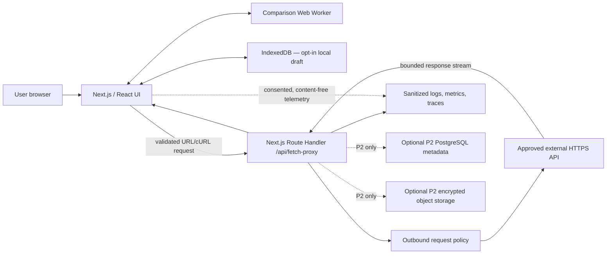
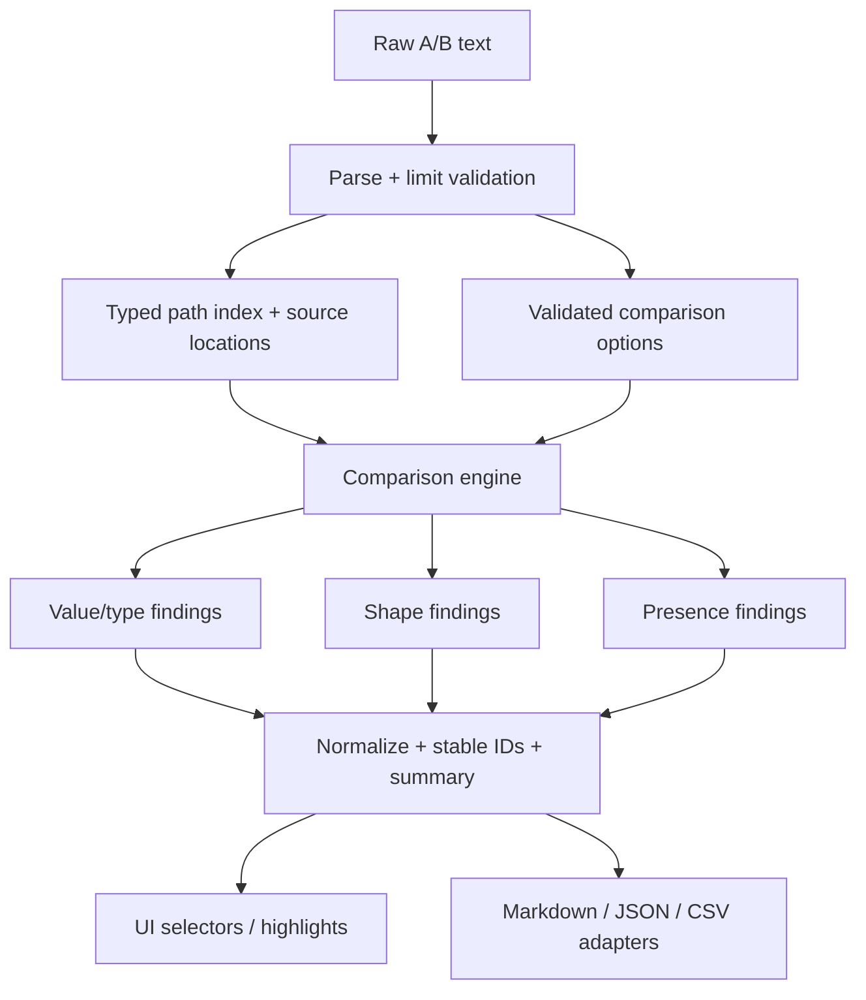

# Architecture — JSON Comparer

Status: Current implementation; explicitly marked P2 sections describe future options only.
Decision baseline: local-first MVP with a narrowly scoped remote-fetch backend.

## 1. Architectural drivers

The design must preserve local privacy, extract the artifact's comparison behavior into a testable core, keep the interface responsive on large documents, provide safe remote import, and allow—not require—future multi-user persistence. Simplicity is favored over microservices. The deployable unit is one Next.js application plus an optional PostgreSQL/object-storage capability that remains disabled until product requirements justify it.

## 2. High-level system architecture



The browser never sends comparison payloads to the server for local operations. Only an explicit remote import passes request data through the fetch endpoint. Server rendering supplies the shell; the interactive comparer is a client boundary. Next.js Route Handlers are appropriate as a backend-for-frontend, but Next.js itself notes this is an API layer rather than a full backend replacement ([Next.js BFF guide](https://nextjs.org/docs/app/guides/backend-for-frontend)). If later workflows require queues, long jobs, or high-volume collaboration, extract those capabilities behind the same application-service interfaces.

## 3. Frontend architecture

### Component boundaries

- `app/page.tsx`: route composition only.
- `Comparer`: workspace state, worker lifecycle, remote-import coordination, and report orchestration.
- `JsonInputPane`: editor/tree tabs, file import, find, line highlights, minimap, and finding navigation for one response.
- `AddDataModal`: file/URL/cURL import dialog; never persists header values.
- `ComparisonControls`: array mode, ignore rules, highlight visibility, and primary actions.
- `ComparisonResults`: summary, filters, missing/structure/difference sections, selection, and review notes.
- `ExportPreview`: report preview actions and content surface.
- `ValueCell` and `JsonTree`: focused comparer-specific presentation components.

### State management strategy

The current single-route workflow uses React state in `Comparer`; introduce a reducer or context only when state is shared across routes or independent consumers. State is partitioned conceptually:

- Domain state: parsed document handles, immutable options, comparison result, annotations.
- View state: active tabs, expanded nodes, filters, selection, focus/navigation target.
- Async state: worker job ID/progress/cancellation and remote-import request state.
- Persistent local state: none in the current implementation; payloads remain ephemeral.
- Server state: none for MVP other than a single fetch mutation. If P2 CRUD arrives, add TanStack Query only then.

Avoid Redux/Zustand initially: one reducer gives explicit transitions without a dependency. Avoid storing derived filtered rows; compute memoized selectors from findings, annotations, and filters.

### Editor and tree approach

Start with native textarea plus accessible line/navigation affordances to minimize bundle and preserve paste performance. Replace the artifact's manually mirrored gutters with isolated hooks/components. If product requirements demand syntax editing, adopt CodeMirror 6 after bundle, accessibility, and large-document evaluation; it is not a baseline dependency. The tree uses semantic disclosure controls, lazy children, and windowing above a measured node threshold.

## 4. Domain and worker architecture

The comparison engine is a framework-free TypeScript package. It accepts serializable requests and returns serializable results so the same code runs in a Web Worker, Node tests, or a future job worker.



Internal paths are `PathSegment[]` and serialize as RFC 6901 JSON Pointer, eliminating ambiguity from dot notation. A presentation adapter may show familiar dotted paths when lossless.

For ordered arrays, recurse by index and report insert/delete/change. For unordered arrays, canonicalize once, compute a stable hash, bucket by hash, then verify canonical equality to handle collisions. Matching duplicates consumes bucket counts. Unmatched complex values are reported as add/remove unless an explicit identity-key strategy is configured; the artifact's arbitrary unmatched pairing should not be preserved as truth. Iterative traversal replaces unbounded recursion. Limits and cancellation checks occur throughout.

The worker protocol is versioned:

```text
CompareRequest { protocolVersion, jobId, rawA, rawB, options, limits }
CompareProgress { jobId, phase, completed, total? }
CompareSuccess { jobId, documents, result, diagnostics, durationMs }
CompareFailure { jobId, problem }
CancelRequest { jobId }
```

Never use dynamic evaluation. Transfer/copy costs for multi-megabyte strings must be benchmarked; if they dominate, parse inside the worker and retain worker-side document handles.

## 5. Backend/API architecture

`app/api/fetch-proxy/route.ts` is a thin HTTP adapter. It validates input, applies request-size/rate-limit policy, calls `executeSecureFetch`, and maps failures to safe JSON. `src/server/fetch/` owns DNS resolution, address classification, address pinning, redirect revalidation, method/header policy, timeout, and response-byte limits. `src/features/comparer/services/remote-fetch.ts` is the browser-facing client for this API.

```mermaid
sequenceDiagram
  actor User
  participant UI as Import dialog
  participant API as POST /api/fetch-proxy
  participant Policy as Fetch policy
  participant DNS as DNS resolver
  participant Target as External API

  User->>UI: Paste URL/cURL
  UI->>UI: Parse supported subset; preview and confirm
  UI->>API: Validated request
  API->>Policy: Validate method, headers, URL, limits
  Policy->>DNS: Resolve hostname
  DNS-->>Policy: Addresses
  Policy->>Policy: Reject private/reserved destinations
  Policy->>Target: Bounded HTTPS request
  Target-->>Policy: Redirect or response
  Policy->>Policy: Revalidate every redirect; enforce bytes/time
  Policy-->>API: Sanitized metadata + response body
  API-->>UI: Success or stable problem response
  UI-->>User: Populate chosen side; announce result
```

Important deployment caveat: a generic proxy is high-risk. DNS resolution checks alone may not guarantee the HTTP client connects to the checked address. Use an egress-controlled network/proxy or a client that supports verified address pinning, and security-test redirect and rebinding cases. If the hosting platform cannot provide credible outbound controls, restrict imports to an administrator-configured hostname allowlist or remove server fetch from MVP.

## 6. Persistence architecture

### MVP local persistence

An IndexedDB repository stores `WorkspaceEnvelope` records with schema version and migration functions. Preferences may persist by default; raw payloads and credential-bearing imports do not. Draft writes are debounced, quota errors are visible, and Clear deletes the workspace record. Export/import is the portability mechanism.

### Optional P2 cloud persistence

PostgreSQL stores relational ownership, workspace membership, comparison metadata, annotations, share grants, and audit events. Prisma provides typed access and migrations. Full response bodies belong in encrypted object storage, addressed by opaque keys and integrity checksums. Envelope encryption, key rotation, retention jobs, delete propagation, backups, and restore drills become release requirements. No P2 table or dependency should ship unused in MVP.

## 7. Authentication and authorization

MVP has no account boundary; every local workspace belongs to the browser profile. The fetch endpoint is public infrastructure and therefore needs abuse protection independent of login: rate limiting, body limits, CAPTCHA/WAF if warranted, and preferably destination allowlisting.

If P2 cloud workspaces are approved, use Auth.js with an OIDC provider and database-backed users/sessions. Authentication establishes identity; a separate authorization service checks `workspaceId` membership and role on every server operation. Roles: Owner, Editor, Viewer. Share tokens are hashed at rest, scoped, expiring, revocable, and read-only by default. Never rely on hidden UI controls for authorization.

## 8. Validation and error model

Zod schemas validate environment variables, worker messages, local envelopes, API inputs, and API responses at trust boundaries. JSON payload contents remain `unknown`/`JsonValue`, not application DTOs.

Domain errors are discriminated unions such as `INVALID_JSON`, `LIMIT_EXCEEDED`, `CANCELLED`, `UNSUPPORTED_CURL_OPTION`, `FETCH_TARGET_DENIED`, `FETCH_TIMEOUT`, and `REMOTE_RESPONSE_TOO_LARGE`. HTTP errors use `application/problem+json` with `type`, `title`, `status`, `code`, `detail` (safe), and `requestId`. UI maps codes to corrective actions. Unexpected errors are captured, correlated, and shown without stack traces or secrets.

## 9. Logging and observability

- Server: structured JSON through Pino; request IDs propagated in response headers; severity and sampling policies by environment.
- Traces/metrics: OpenTelemetry instrumentation for route and outbound-fetch spans; sanitized hostname category rather than raw URL; deployment/provider exporters configured outside the domain.
- Client: Web Vitals and content-free failure/performance events only after consent requirements are resolved. Do not attach payloads, path strings, notes, headers, or report bodies to error monitoring.
- Dashboards: request rate/errors/duration; policy denials; outbound status/timeout/bytes; worker failures and local comparison duration percentiles; deployment version.

## 10. Testing architecture

- Unit: Vitest for canonicalization, path encoding, ordered/unordered diffs, shape inference, ignore matching, line/source indexing, reducer, schemas, and report renderers.
- Property/fuzz: `fast-check` asserts symmetry where applicable, identity (`diff(x,x)`), key-order invariance, duplicate multiset behavior, no crashes for generated bounded JSON, and stable serialization.
- Component: Testing Library with user-event and axe checks for dialogs, tabs, filters, results, annotations, status regions, and keyboard navigation.
- Worker contract: protocol compatibility, cancellation, malformed messages, limits, and deterministic fixtures.
- API integration: mock DNS and outbound HTTP; cover private/reserved IPs, IPv4/IPv6, redirects, rebinding-resistant behavior, header stripping, decompression bombs, timeouts, aborts, and rate limits.
- End-to-end: Playwright for paste/file/compare/filter/annotate/export/restore/import-error flows across Chromium, Firefox, and WebKit.
- Performance: representative fixture suite in CI/nightly with thresholds; browser trace inspection before choosing virtualization/editor dependencies.
- Visual regression: only stable key states; avoid broad brittle snapshots.

## 11. Security architecture

Trust boundaries exist at user input, imported files, worker messages, IndexedDB, route requests, DNS, redirects, remote responses, exports, environment, and optional database/object storage. Apply allowlists, typed validation, byte/depth/time limits, output encoding, restrictive headers, request isolation, and least privilege at each boundary.

Threats requiring explicit tests: SSRF and DNS rebinding, credential leakage, malicious huge/deep JSON, compressed response expansion, stored/reflected XSS through filenames/keys/notes, CSV formula injection in P1 CSV export, IDOR in P2 workspaces, malicious workspace imports, dependency compromise, and denial-of-service through high-cardinality findings.

Security headers are configured centrally. CSP should avoid `unsafe-inline`/`unsafe-eval`; use framework nonces/hashes where required. Remote import does not forward arbitrary dangerous headers (`Host`, `Cookie`, hop-by-hop headers) and never exposes internal response headers. Deployment egress denies internal address ranges at the network layer as defense in depth.

## 12. Deployment architecture and environments

Containerize the Next.js Node runtime using a minimal non-root image and standalone output, or deploy to a managed Next.js platform that supports the required timeout, streaming, DNS/egress controls, and observability. Do not select a vendor until SSRF egress requirements are validated.

Environments: local, preview per pull request, staging, production. Each has isolated secrets and rate-limit stores; P2 databases/storage are isolated. Only public, non-secret configuration uses `NEXT_PUBLIC_*`. Server environment is parsed once at startup and fails closed. `.env.example` contains names and safe descriptions, never values.

CI pipeline:

```mermaid
flowchart LR
  PR["Pull request"] --> INST["Frozen install"]
  INST --> Q["Format + lint + typecheck"]
  Q --> UNIT["Unit + property + component"]
  UNIT --> BUILD["Production build"]
  BUILD --> SEC["Dependency, secret, and container scans"]
  SEC --> PREVIEW["Ephemeral preview"]
  PREVIEW --> E2E["E2E + accessibility + API security"]
  E2E --> APPROVE["Protected approval"]
  APPROVE --> PROD["Immutable production deploy"]
  PROD --> SMOKE["Smoke checks + monitored rollout"]
  SMOKE -->|"failure"| ROLL["Rollback previous image"]
```



Use GitHub Actions or the organization's existing CI. Deploy immutable artifacts; production promotion must reuse the tested artifact. Enable dependency update automation, lockfile review, least-privilege OIDC deployment, protected environments, signed provenance/SBOM where organizational policy requires it, health checks, and rollback runbooks.

## 13. Scalability

Local comparison scales horizontally with clients and avoids server compute/data exposure. Worker execution and virtualized rendering address per-client scale. The fetch API is stateless and horizontally scalable; shared rate limiting requires a managed store only when single-instance limits are insufficient. Stream and cap responses rather than buffering unbounded bodies.

P2 relational metadata scales conventionally with indexed `workspaceId`, cursor pagination, pooled connections, and read replicas only after evidence. Object storage handles payload volume. Long-running or batch comparisons would move to a queue/worker service with status polling, not be forced into Route Handler lifetimes. Avoid premature caches, message brokers, microservices, and Kubernetes.

## 14. Module dependency rules

Dependencies flow inward: `app` adapters compose `features` and `server`; features may use domain and worker contracts; workers and server modules may use domain contracts; domain imports none of React, Next.js, DOM, storage, logging, or database packages. API routes delegate outbound execution to `src/server/fetch/` and never implement socket/DNS policy directly. Tests may depend inward and replace resolver/requester boundaries with fakes.

Display alignment is a presentation transform implemented as pure domain logic. The worker compares the original parsed values first, then aligns cloned values for display. The paired display formatter emits equal-height line blocks and JSON-safe blank placeholders for one-sided fields/subtrees, together with actual and placeholder path-to-line maps. These maps drive raw-JSON highlights and navigation on both sides. Editors with this shared line structure synchronize the same vertical offset; temporarily unaligned manual input falls back to proportional scrolling. Browser input actions apply the transform only when both complete inputs parse successfully.

## 15. Current project structure

```text
json-comparer/
├── app/
│   ├── api/fetch-proxy/               # thin HTTP adapter and route tests
│   ├── error.tsx                      # route error boundary
│   ├── layout.tsx                     # metadata, providers, shell
│   ├── page.tsx                       # comparer route composition
│   └── globals.css                    # tokens and global styles
├── src/
│   ├── domain/comparison/             # parsing, paths, value/shape algorithms
│   ├── domain/fetch/                  # framework-free cURL/request parsing
│   ├── domain/reporting/              # report model/renderers
│   ├── features/comparer/             # UI, feature CSS, hooks, services, adapters
│   ├── server/fetch/                  # SSRF policy and outbound execution
│   ├── workers/comparison.worker.ts    # worker entry adapter
│   └── ...                             # tests colocated with owning modules
├── .agents/skills/                    # repository-local maintenance skills
├── public/                             # static non-code assets
├── docs/                               # ADRs, runbooks, threat model
├── next.config.ts                      # headers/build settings
├── vitest.config.ts
├── eslint.config.mjs
├── tsconfig.json
├── package.json
├── pnpm-lock.yaml
├── .env.example
└── README.md
```

Colocate unit/component tests beside source where ownership is clearest; reserve a future top-level `tests` directory for cross-module suites only. Add persistence, observability, E2E, or P2 infrastructure when a concrete requirement needs it—not as empty scaffolding.

## 16. Architecture decisions and alternatives

- Next.js monolith over separate SPA/API: one deployable and TypeScript boundary; Vite SPA is preferable if remote fetch is removed and purely static hosting is the goal.
- Web Worker over server comparison: privacy, latency, and horizontal scale; server jobs are an optional large-file tier.
- Reducer/context over global store library: sufficient initial state complexity and fewer dependencies; Zustand/Redux Toolkit can be reconsidered with measured cross-route/shared-state pressure.
- IndexedDB over localStorage: capacity and structured async access; do not assume it is secure storage.
- PostgreSQL/Prisma only for approved P2 persistence: relational authorization and migrations; Drizzle/Kysely are leaner alternatives for teams preferring SQL control.
- Native components/headless patterns before a full UI kit: accessible ownership with lower dependency surface; Radix primitives may be added selectively for difficult dialogs/popovers.

## 17. Source and artifact traceability

The conclusions above derive from direct static inspection of the provided artifact. Technology details were checked against primary documentation: [Next.js documentation](https://nextjs.org/docs), [React version information](https://react.dev/versions), [Zod](https://zod.dev/), [Prisma ORM](https://docs.prisma.io/docs/orm), [Vitest](https://vitest.dev/guide/), [Playwright](https://playwright.dev/docs/intro), [Tailwind CSS](https://tailwindcss.com/docs/installation/framework-guides/nextjs), and [OpenTelemetry JavaScript](https://opentelemetry.io/docs/languages/js/).
