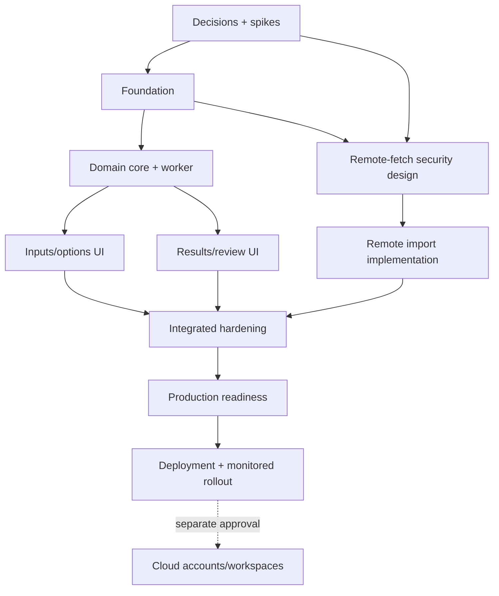

# Implementation Plan — JSON Comparer

This is a delivery plan, not implementation. Estimates are relative engineering effort and must be recalibrated after unresolved SRS decisions and technical spikes.

## 0. Decision gate and discovery

Outcome: approved MVP boundary and measurable targets.

- Resolve array semantics, deployment model, remote-import scope, security/compliance classification, browser/input limits, persistence/account needs, exports, and performance reference device.
- Convert artifact behavior into sanitized golden fixtures and a behavior inventory; capture deliberate compatibility and deliberate changes.
- Run spikes for worker transfer/compute, source-location mapping, editor/tree choice, result virtualization, and secure egress feasibility.
- Produce ADRs: local-first boundary, array semantics, path representation, remote-fetch disposition, persistence/auth scope, hosting choice.
- Threat-model remote import and sensitive payload handling before coding its endpoint.

Exit criteria: product/security approve SRS priorities and limits; unresolved P0 questions are closed; spike evidence selects editor, virtualization threshold, and remote-import approach.

## 1. Foundation and setup

Outcome: deployable empty application with enforced quality controls.

- Scaffold Next.js App Router + strict TypeScript + pnpm; establish supported Node version.
- Add CSS tokens/Tailwind, semantic application shell, metadata, error/loading boundaries, baseline security headers, and CSP plan.
- Configure ESLint, Prettier, Vitest/coverage, Testing Library, Playwright, axe helper, and CI frozen installs.
- Add environment validation, request-ID middleware/utility, structured server logging, and `.env.example`.
- Establish module boundary rules, error/result conventions, fixtures, ADR template, contribution guide, and dependency policy.
- Create preview deployment and smoke test without enabling remote fetch.

Exit criteria: lint, formatting check, typecheck, unit test, production build, dependency/secret scan, preview deploy, and smoke test pass from a clean clone.

## 2. Core architecture

Outcome: tested domain engine and worker contract, independent of UI.

- Define `JsonValue`, typed paths/JSON Pointer codec, findings, stable IDs, options, limits, diagnostics, annotations, summaries, and versioned protocols.
- Implement bounded parser/source index, iterative object traversal, ordered-array diff, hashed unordered-multiset diff, structure analysis, ignore-rule parser/matcher, and report model.
- Define cancellation/progress checkpoints and run the engine in a Web Worker.
- Write golden, unit, property, fuzz, protocol, performance, and memory tests; reconcile outputs against artifact fixtures and document intentional changes.
- Implement application commands/reducer/selectors with invariant tests; no UI-specific logic in the domain.

Exit criteria: identity/order/duplicate/path/limit invariants pass; representative 1 MB fixture meets provisional compute target; cancellation works; no framework imports exist in domain packages.

## 3. Feature migration

Outcome: complete local comparison workflow.

### 3A. Inputs and options

- Build two accessible input panes with paste, bounded file import, validation, prettify, find, text/tree tabs, and parse diagnostics.
- Implement comparison options, explicit array-mode labeling, validated ignore rules with match preview, and destructive-clear confirmation.
- Add local draft repository, envelope migrations, privacy consent, quota/error UX, restore/discard, and clear behavior.

### 3B. Results and review

- Build summary and missing/structure/value result views with category/path/group filters.
- Add stable A/B navigation, lazy tree and threshold-based virtualized results, keyboard focus management, and non-color category cues.
- Add review status, notes, selections, consistent ignored-state projections, and full/selected Markdown export with privacy warning.
- Add versioned workspace import/export if retained as P1.

### 3C. Remote import (only after security gate)

- Specify supported URL/cURL grammar; reject unsupported options with precise feedback.
- Implement import preview and secret warning without persisting header values.
- Implement fetch route through policy/service interfaces: method/header/scheme/port rules, DNS/IP/redirect validation, egress controls, timeout, byte/decompression/redirect limits, rate limiting, response sanitization, abort, and safe problem responses.
- Add security integration tests before enabling the feature flag in production.

Exit criteria: primary and error flows pass component/E2E/accessibility tests; artifact capabilities classified “compatible,” “intentionally changed,” or “deferred”; fetch threat controls are independently reviewed or feature stays disabled.

## 4. Testing and hardening

Outcome: evidence that the product is correct, accessible, secure, and performant.

- Expand edge fixtures: root primitives, nulls, escaped/unicode keys, large numbers, empty/heterogeneous/nested arrays, duplicates, reordered items, deep documents, malformed text, result caps.
- Test reducer races: edit while worker runs, stale job response, cancel/restart, restore version mismatch, quota errors, filters while annotations change.
- Cross-browser Playwright runs for Chromium/Firefox/WebKit and responsive viewports.
- Manual keyboard/screen-reader/zoom/reduced-motion/color-contrast review plus automated axe gates.
- Load and profile at agreed sizes; fix long tasks, worker copies, memory retention, tree/table DOM growth, and report generation.
- Security review: XSS, workspace-file validation, CSP, SSRF/rebinding/redirects, header/cookie leakage, compressed/oversized bodies, rate limits, log/trace redaction, dependencies, container.
- Failure injection for worker crash, network timeout, bad DNS, aborted clients, telemetry outage, and corrupted local envelope.

Exit criteria: SRS acceptance criteria pass; no open critical/high security issues; no serious/critical accessibility violations; performance and error budgets are recorded and met.

## 5. Production readiness

Outcome: operable, supportable release candidate.

- Finalize container/managed-host runtime, non-root execution, immutable artifact, health/readiness checks, security headers, and network egress policy.
- Add sanitized metrics/traces/exporter, dashboards, actionable alerts, version markers, and Web Vitals subject to consent.
- Document runbooks for deploy/rollback, fetch abuse/SSRF incident, elevated errors/latency, dependency emergency, and data/privacy request (local-only explanation for MVP).
- Establish support matrix, privacy notice, threat model, architecture decisions, operational ownership, SLOs, release notes, and user help.
- Perform dependency/license/SBOM/provenance checks as organizational policy requires.
- Conduct a release-candidate review against every acceptance criterion and trace requirement → test → evidence.

Exit criteria: staging soak is clean; alerts are tested; rollback is demonstrated; production secrets/egress/rate limits are verified; release sign-offs obtained.

## 6. Deployment and rollout

Outcome: monitored production release with reversible rollout.

- Promote the exact staging artifact through a protected environment using OIDC/least privilege.
- Run migrations only if P2 persistence exists; otherwise there is no database deployment step.
- Use canary/percentage rollout if platform supports it, otherwise blue/green with immediate rollback.
- Run post-deploy smoke flows without real credentials or sensitive payloads.
- Watch error, latency, policy-denial, timeout, worker-failure, and Web Vital dashboards through the agreed observation window.
- Roll back on breached release thresholds; preserve sanitized diagnostic evidence.

Exit criteria: production SLOs hold through the observation window and the release is formally closed.

## 7. Optional P2: accounts and cloud workspaces

This is a separate initiative, not hidden MVP work.

- Confirm tenancy, roles, SSO/MFA, sharing, collaboration, residency, retention/deletion, audit, legal, encryption, backup, and recovery requirements.
- Model PostgreSQL metadata and object storage; select ORM/IdP after focused evaluation.
- Add Auth.js/OIDC authentication and server-side workspace authorization, hashed share grants, audit events, encrypted blobs, migrations, backups, restore drills, deletion jobs, and IDOR tests.
- Add server-state client library only when CRUD caching/invalidation exists.
- Plan data migration from versioned local workspace exports; never upload local drafts without explicit action.

## 8. Workstream dependencies and sequencing

UI foundation and domain fixtures can progress in parallel after contracts stabilize. Remote-fetch work can progress behind a disabled flag, but it cannot ship before security/egress validation. P2 must not delay the local-first release.

## 9. Suggested delivery slices

1. Walking skeleton: paste two small payloads → worker diff → accessible summary, deployed to preview.
2. Correctness slice: all diff modes, paths, limits, fixtures, property tests.
3. Review slice: detailed results, filters, navigation, notes, selections, Markdown export.
4. Resilience slice: local drafts, cancellation, large-data rendering, errors, accessibility.
5. Remote-import slice: only if security gate passes.
6. Operational slice: observability, hardening, runbooks, rollout.

Each slice must be production-shaped: types, tests, accessible errors, telemetry/redaction where relevant, and documentation—not a large untested port of the HTML.

## 10. Risk register

| Risk                                                    | Probability / impact | Mitigation / decision gate                                                                                                |
| ------------------------------------------------------- | -------------------- | ------------------------------------------------------------------------------------------------------------------------- |
| Unclear array semantics changes user results            | High / High          | Resolve before engine API; explicit mode and export metadata; golden compatibility fixtures.                              |
| Remote fetch becomes SSRF/credential exfiltration proxy | High / Critical      | Network egress controls, allowlist fallback, focused review/tests, rate limits; remove/disable if hosting cannot enforce. |
| Large JSON freezes/crashes browser                      | Medium / High        | Worker, iterative traversal, prehashed matching, hard limits, cancellation, virtualization, benchmarks.                   |
| Source line mapping is inaccurate                       | Medium / Medium      | Parser/token locations or proven editor mapping; never regex prettified output as the sole production map.                |
| Sensitive payload leaks through persistence/telemetry   | Medium / Critical    | Local-only default, opt-in content persistence, content-free telemetry, redaction tests, privacy review.                  |
| Accessibility regresses in custom editor/tree           | Medium / High        | Native semantics, documented patterns, keyboard/screen-reader tests, selective mature primitives.                         |
| Premature accounts/DB inflate scope                     | High / Medium        | Separate P2 gate; no unused dependencies or schema in MVP.                                                                |
| Framework/package churn                                 | Medium / Medium      | Active LTS, lockfile, automated updates, compatibility checks, small dependency surface.                                  |

## 11. Definition of done

A phase is complete only when its code, tests, accessibility behavior, error states, security controls, documentation, and operational impact are complete. The overall MVP is done when every P0 SRS requirement and acceptance criterion has traceable passing evidence, production rollback and monitoring work, no unresolved P0 decision remains, and deferred features are explicitly documented rather than partially implemented.
